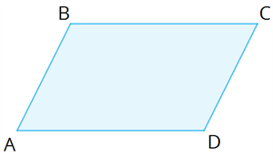

# Параллелограмм
Это фигура с 4 сторонами, где все противолежащие стороны параллельны.

# Свойства параллелограмма
* Противолежащие стороны попарно параллельны (по определению);
* Противолежащие стороны попарно равны;
* Противолежащие углы попарно равны;
* Диагонали делят друг друга пополам;
* Соседние углы дополнительные1;
* Каждая диагональ делит четырехугольник на два равных треугольника;
* Сумма квадратов сторон равна сумме квадратов диагоналей (это закон параллелограмма).

# Особенности работы класса
Класс будет хранить значение всех углов (в градусах для удобного описания) и сторон (в условных единицах измерения длины и в том числе диагоналей). Каждое значение необязательно, для того чтобы пользователь мог построить параллелограмм по недостающим данным и узнать недостающие данные, если это возможно.

## Заметки автора
1) Их сумма равна 180o;

## Источники
* https://en.wikipedia.org/wiki/Parallelogram
